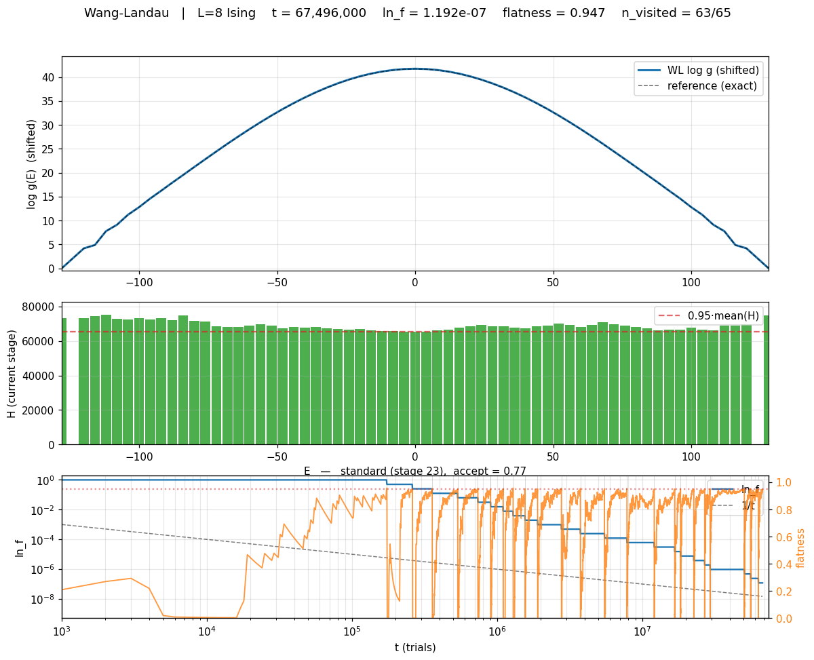

# flatwalk

flatwalk is an enhanced sampling library implementing flat-histogram
methods while being order-parameter and energy-backend agnostic.
flatwalk does the sampling, the user provides the system to sample.
The contract between flatwalk and the user is the following:

| You supply | Type | What flatwalk does with it |
| --- | --- | --- |
| `bin_scheme` | `BinScheme` instance | maps `Q → bin index` |
| `energy_fn(state)` | `→ float` | the `−β·ΔE` term in WL acceptance (skip when `β=0` and `Q=E`) |
| `order_parameter_fn(state)` | `→ float \| np.ndarray` | the quantity `g(Q)` is estimated over (vector for ≥2D) |
| `propose_move_fn(state, rng)` | `→ (new_state, log_proposal_ratio)` | one Markov step |

`state` is opaque to flatwalk — whatever your callbacks recognise:
tuple, dataclass, numpy array, torch tensor, anything. You hand one
initial `state` object to `driver.run(...)` to start; from there the
callbacks do all state manipulation.

## Capabilities

### Implemented

- 1D order-parameter Wang-Landau with the Belardinelli-Pereyra 1/t-WL
  transition
- Atomic checkpoint and bit-identical resume (full RNG state preserved)
- Per-check `progress_callback` and per-trial `trial_callback` hooks;
  TSV trace writer for offline diagnostics
- Live matplotlib viewer (3 stacked panels) with headless PNG / mp4 /
  gif export
- Per-trial trajectory video with current-bin highlight, per-stage
  cumulative histogram, and Ising spin-grid overlay
- Validated against Beale's exact `n(E)` on the 2D Ising L=8 torus,
  cross-checked against brute-force enumeration on L=3 and L=4; the
  full validation runs in CI

### Planned

See [docs/storyline.md](docs/storyline.md) for design rationale and
line-count estimates.

- **Batched walkers.** `BatchedCallbacks` + `WalkerBatch` so ≥2
  walkers move through the system in one batched callable per tick.
  This is the path by which a GPU energy backend (PyTorch, JAX) gets
  its speedup — one stacked forward pass per tick, not N sequential
  ones.
- **Replica-exchange Wang-Landau.** A concrete `ExchangeHandler` on
  top of the batched layer; the ABC and driver call site are already
  wired so this is additive, not a rewrite.
- **≥2D order parameters.** `BinND` as a sibling of `Bin1D`; the
  driver's `g` stays a flat 1D ndarray, only the binning changes.
- **2D Ising in (E, M) Beale extension.** Exact reference for the
  multi-D order-parameter and REWL validations.

## Install

Editable install via [uv](https://github.com/astral-sh/uv):

```bash
uv venv .venv
uv pip install --python .venv/bin/python -e ".[test]"
```

Plain pip works too (`pip install -e ".[test]"`) but Homebrew Python may
require `--break-system-packages` or a venv.

## Quick start

Below, block 1 fills the five-piece contract for the 2D Ising model;
block 2 is the `flatwalk` setup and run — verbatim across systems.

```python
import numpy as np
from flatwalk import Bin1D, WLConfig, WLDriver

# ──────────────────────────────────────────────────────────────────
# 1. Your physics — replace this block to use a different system.
#    flatwalk doesn't know or care what `state` is.
# ──────────────────────────────────────────────────────────────────
L = 8

def energy_fn(state):
    return state[1]                                # cached E, O(1)

def order_parameter_fn(state):
    return state[1]                                # WL on E: Q = E

def propose_move_fn(state, rng):                   # single-spin flip
    spins, E = state
    i, j = int(rng.integers(0, L)), int(rng.integers(0, L))
    s = int(spins[i, j])
    nb_sum = int(spins[(i-1)%L, j] + spins[(i+1)%L, j] +
                 spins[i, (j-1)%L] + spins[i, (j+1)%L])
    dE = 2.0 * s * nb_sum                          # ΔE in O(1)
    new_spins = spins.copy(); new_spins[i, j] = -s
    return (new_spins, E + dE), 0.0                # symmetric → lpr = 0

initial_state = (np.ones((L, L), dtype=np.int8), -2.0 * L * L)
bin_scheme = Bin1D(low=-2*L*L - 2, high=2*L*L + 2, n_bins=L*L + 1)

# ──────────────────────────────────────────────────────────────────
# 2. Generic flatwalk wiring — unchanged across systems.
# ──────────────────────────────────────────────────────────────────
cfg = WLConfig(bin_scheme=bin_scheme, beta=0.0, ln_f_final=1e-8,
               trace_path="trace.tsv")
result = WLDriver(cfg).run(
    initial_state, energy_fn, order_parameter_fn, propose_move_fn,
    rng=np.random.default_rng(0),
)
print(result.g)                                    # log density of states
```

To run a different model you'd replace block 1 only (your callbacks,
`initial_state`, and the `Bin1D` range for your `Q`); block 2 stays
verbatim. See [examples/ising.py](examples/ising.py) for the
production Ising implementation used by the validation, and
[examples/ising_validation.py](examples/ising_validation.py) for the
full pass/fail run.

## API surface

| Symbol | Purpose |
| --- | --- |
| `Bin1D`, `BinScheme` | Map order-parameter values to flat bin indices. `BinScheme` is an ABC — implement `BinND` for higher dimensions. |
| `WLConfig` | One-shot config: bin scheme, β, flatness threshold, n_check, ln_f targets, checkpoint path, trace path. |
| `WLDriver` | The sampler. `.run(...)` returns a `WLResult`. |
| `WLResult` | g, H, visited mask, bin geometry, t_total, n_f_stages, ln_f_final, converged, final state, RNG state. |
| `Walker` | Per-replica state container (state, bin_current, energy, RNG, counters). The driver loops over `Walker`s — single-walker today, multi-walker tomorrow. |
| `TraceWriter`, `TraceRow`, `read_trace` | TSV-backed per-check diagnostics (`t`, `ln_f`, flatness, acceptance rate, min/max/mean H, n_visited, 1/t-regime flag, stage index). Abstraction allows swapping to Parquet without changing callers. |
| `ExchangeHandler` | Abstract hook for replica-exchange WL. Not implemented; the driver loop already has the call site so REWL plugs in additively. |
| `save_checkpoint`, `load_checkpoint` | Atomic .npz checkpoints (`.tmp` + `os.replace`) preserving full RNG state. |

## Validation: 2D Ising

The driver is validated against the exact density of states `n(E)` for the
2D Ising model on an L×L torus, computed via a Beale-style transfer-matrix
recursion with modular CRT (see [examples/beale.py](examples/beale.py)).

[examples/ising_validation.py](examples/ising_validation.py) runs the
driver to `ln_f_final = 1e-8` on L=8 and compares against Beale:

```bash
.venv/bin/python examples/ising_validation.py --seed 0
```

Pass criteria (spec §4.4):
- `max ε(E) < 0.05` over visited central bins (excluding the two extremes).
- `mean ε(E) < 0.01`.
- `max |⟨E⟩_WL − ⟨E⟩_exact| / |⟨E⟩_exact| < 0.5%` over T ∈ [1, 4].
- C_V peak temperature within 2% of exact.

Beale's recursion is cross-validated against brute-force enumeration on
L=3 (512 configs) and L=4 (65,536 configs) in
[tests/test_beale.py](tests/test_beale.py).

A `--quick` flag runs to `ln_f_final = 1e-5` (~30 s) for smoke testing the
pipeline; the resulting `g_WL` will NOT meet the spec criteria but is
useful for development.

### Live visualization

The driver fires an optional `progress_callback(snapshot)` once per
`n_check` trials. [examples/wl_viewer.py](examples/wl_viewer.py)
provides a three-panel matplotlib viewer that consumes these snapshots:

- **log g(E)** with optional reference overlay (e.g. exact Beale n(E) for
  Ising).
- **H(E)** histogram with the flatness threshold line; resets visibly
  at each f-stage transition.
- **ln_f and flatness vs t**, log-log, with the 1/t reference line
  dashed.

Run the validation with the viewer:

```bash
.venv/bin/python examples/ising_validation.py --viewer --seed 0
# headless: save a final-frame PNG
MPLBACKEND=Agg .venv/bin/python examples/ising_validation.py \
    --viewer-out demo.png --seed 0
```



`--viewer` forces `--n-seeds 1` (the visualization tracks a single
walker). The viewer rate-limits drawing to ~10 fps so the WL run pays
only ~5% matplotlib overhead.

### Video of the full run

```bash
MPLBACKEND=Agg .venv/bin/python examples/ising_validation.py \
    --viewer-movie wl_demo.mp4 --movie-frames 500 --movie-fps 24 --seed 0
```

A `SnapshotRecorder` callback buffers snapshots on a log-spaced
schedule in t (so the early stages — where g and H change visibly
between checks — get many frames while the late 1/t regime is sampled
sparsely). After the WL run completes, `make_movie` re-plays them
through the viewer panels and renders an mp4 (via ffmpeg) or gif (via
Pillow, automatic fallback). The committed
[examples/wl_demo.mp4](examples/wl_demo.mp4) is a ~10 s, ~3 MB video
of an L=8 run from `t=10³` through 1/t-regime entry to convergence at
`ln_f = 10⁻⁸`.

### Per-trial trajectory video

A separate `trial_callback(t, bin_current, energy, ln_f, accepted)`
hook fires once per individual trial (cheap; None by default).
`TrialRecorder` buffers per-trial state and `make_trajectory_movie`
renders an animation where the walker hops bin-by-bin while the
histogram and `log g(E)` build up from zero, with the current bin
highlighted in red and the walker's `E(t)` plotted at the bottom:

```bash
# Long converged run (~3.5 min video, watches g(E) reach the exact reference):
.venv/bin/python examples/wl_trajectory_demo.py -L 8 \
    -n 1100000 --n-check 2000 --flatness 0.8 \
    --schedule "1500:1,30000:20,1100000:300" --fps 30 \
    -o wl_trajectory_flatness.mp4

# Short run, every-trial playback:
.venv/bin/python examples/wl_trajectory_demo.py -L 8 -n 1500 \
    -o wl_trajectory.mp4
```

The committed
[examples/wl_trajectory_flatness.mp4](examples/wl_trajectory_flatness.mp4)
is ~3:36 at 30 fps, animating a 1,100,000-trial L=8 run with 11
f-stage halves. The playback is **piecewise-constant in speed**, set
by the `--schedule` flag: every trial for the first 1,500 (50 s of
video), every 20th trial through 30,000 (~47 s), then every 300th
trial through 1,100,000 (~119 s, leaving ≥10 s for each of the final
900K→1M and 1M→1.1M windows). The user can swap to a log-spaced
schedule with `--n-frames N`.

**Cumulative H, stacked by f-stage.** The middle panel shows the
cumulative visit count (no reset — the bias lives in `g`, not `H`).
Bar segments are stacked and colored by which f-stage produced each
visit, using a viridis ramp. With eleven halves firing in this run,
twelve stages contribute: stage 0 (dark purple, bottom, ~58K trials at
`ln_f=1`) dominates, with thinner segments (cyan → green → yellow)
layered above as `ln_f` decays. The top edge of the stacked bars
approaching a flat line is the "flatness" signal. The red vertical
line marks the walker's current bin.

**Per-stage H overlay.** A dark-orange line on the right-hand axis
shows the **current-stage** ``H(E)`` — this is the histogram the
algorithm actually evaluates against `flatness_threshold` to decide
when to halve. The line resets to zero at every halve and rebuilds
within the new stage; its `min/mean` ratio (the flatness number) is
printed in the title alongside the configured threshold (default 0.8).

**Stage colorbar + spin grid.** The stage → colour mapping is shown
as a discrete colorbar to the right of the histogram (no in-axes
legend to clutter the bars). A fourth panel on the far right
visualizes the current **Ising spin configuration** as an L×L grid
(red = +1, blue = −1). When the walker is near the FM ground state
(``E = −2L²``) the grid is overwhelmingly one colour; near the AF
state (``E = +2L²``) it's a checkerboard. Spin snapshots are captured
at exactly the frame indices the renderer will display, so memory
is bounded by the frame count rather than the trial count.

### Divergences from spec, and why

To meet the spec §4.4 pass criteria on L=8 (`max ε < 5%`, `mean ε < 1%`)
the validation script makes two script-level tuning choices and one
multi-run averaging choice, *none of which touch the `flatwalk` driver*:

1. **WL hyperparameters** `n_check = 1000`, `flatness_threshold = 0.95`
   (spec defaults: 10_000, 0.8). The spec marks both as "Tunable" in
   §1.5, so this is within bounds. Smaller `n_check` triggers the 1/t
   regime sooner; stricter flatness gives each f-stage more samples so
   `g[bin]` is better-equilibrated at each halving.

2. **Multi-seed averaging** (`--n-seeds 3`). A single-seed single-walker
   1/t-WL on L=8 produces a `g_WL` with ~5–10% per-bin error in the
   high-|E| tails. The asymmetry is *between* `E` and `−E` and arises
   from the trajectory: the walker reaches one tail before the other and
   accumulates more early (large-`ln_f`) updates there. Averaging the
   `log g` arrays from `K` independent seeds reduces the variance by
   `~1/K`. This is standard practice in WL literature; REWL (see
   [`flatwalk.exchange`](flatwalk/exchange.py)) is the more elegant
   solution but is out of scope for M3.

   `--n-seeds 1` recovers the pure spec interpretation ("Run the
   driver"). The driver itself is single-walker and bit-identical on a
   fixed seed.

## Architectural notes (for future extension)

These choices distinguish flatwalk from a throwaway driver. They cost ~150
extra lines of code now and save rewriting the core later.

1. **`BinScheme` abstraction.** All bin indexing goes through
   `bin_scheme.value_to_index(q)` and `bin_scheme.index_to_center(idx)`.
   Adding `Bin2D(...)` for a 2D order parameter requires no driver changes
   — just implement the abstract methods and pass the new scheme to
   `WLConfig`.

2. **Vector-typed order parameter.** `order_parameter_fn` returns
   `Union[float, np.ndarray]`. The 1D Ising case returns a float; a future
   `(E, M)` case returns a length-2 ndarray. The driver passes the value
   directly to `bin_scheme.value_to_index`.

3. **`Walker` ownership.** Per-trial state (current configuration, cached
   energy, RNG, counters) lives on a `Walker`, not on `WLDriver`. The
   per-trial logic is `WLDriver._trial_step(walker, …)`. A shared-`g`
   multi-walker variant becomes a loop over walkers rather than a rewrite.

4. **`ExchangeHandler` hook point.** The main loop already has the call
   site for REWL exchanges every `n_exchange` trials. The current build
   doesn't ship an implementation, so single-walker runs pay zero cost
   (the field is `None`).

### 2D-WL validation target

When the driver is later extended to 2D order parameters, the analogous
validation is **2D Ising in (E, M)**: Beale's recursion can be extended
to give exact `g(E, M)` for moderate L, and the same `max ε < 5%`,
`mean ε < 1%` criteria apply per bin.

### REWL validation target

When REWL is implemented, the canonical validation is to run L=8 Ising
with N_windows = 4 overlapping windows on E, exchange every N_exchange
trials, and verify the joined `g(E)` matches the single-window result
within statistical noise.

## Layout

```
flatwalk/
  binning.py        — BinScheme ABC + Bin1D
  walker.py         — Walker dataclass
  core.py           — WLConfig, WLResult, WLDriver
  exchange.py       — ExchangeHandler ABC (REWL hook)
  diagnostics.py    — TraceWriter + TraceRow + read_trace
  io.py             — save_checkpoint / load_checkpoint
tests/
  test_binning.py
  test_diagnostics.py
  test_core.py
  test_checkpoint.py
  test_beale.py
  test_ising.py
  test_imports.py
examples/
  beale.py             — Exact n(E) via transfer matrix + CRT
  ising.py             — Ising callbacks for the WL driver
  ising_validation.py  — end-to-end pass/fail run
  cache/               — Beale results cached as TSV (created on first run)
```

## License

MIT.
